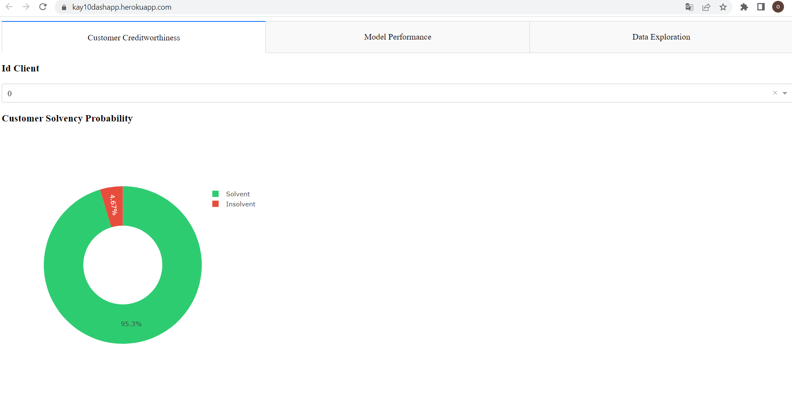
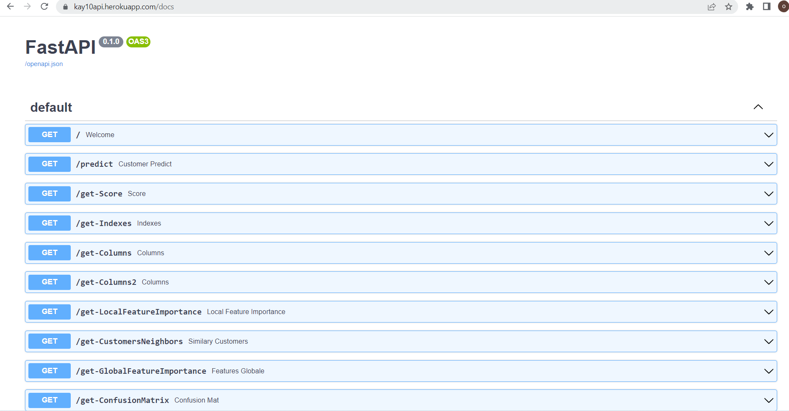

# Projet 7
## Implémentez un modèle de scoring
La société financière nommée "Prêt à dépenser" propose des crédits à la consommation pour des personnes ayant peu ou pas du tout d'historique de prêt. 
Cette dernière souhaite mettre en œuvre un outil de “scoring crédit” relatif à une classification des demandes en crédit accordé ou refusé.

L'objectif est de développer un modèle de scoring calculant la probabilité de défaut de paiement d'un client pour étayer la décision d'accorder ou non un prêt à un client potentiel.

Tous les fichiers .csv sont téléchargeables à l'adresse suivante : https://www.kaggle.com/c/home-credit-default-risk/data".

La description des différentes tables est la suivante:

### Modelisation
Le fichier P7_Processing&Modelling.ipynb contenu dans le dossier "dossier_code"  est relatif au code de la modélisation du prétraitement à la prédiction:
  - Choix du kernel
  - Traitement les valeurs abérrantes et manquantes
  - Exploration du jeu de données
  - Développement et simulation des modèles
  - Choix du meilleur modèle et optimisation des hyper-paramètres d'un point de vue métier
  - Analyse des feature importance globale et locale
 
### Dashboard
Le fichier dashboard.py contenu dans le dossier "dossier_code" est relatif au code générant le dashboard lequel est hébergé sur le serveur cloud Heroku et accessible à cette adresse:

https://kay10dashapp.herokuapp.com/  

L'ensemble des fichiers qui permis de le générer sont dispobibles à l'adresse: https://github.com/olivierkayyong/Dashboard
  
Dans l'image en dessous, on peut voir un aperçu du site:
  

### Api
Le fichier api.py et api_processing contenus dans le dossier "dossier_code" sont relatifs aux codes permettant de déployer le modèle sous forme d'API qui est également hébergé sur le serveur cloud Heroku et accessible à cette adresse: 

https://kay10api.herokuapp.com/docs  
L'ensemble des fichiers qui permis de le generer sont dispobibles à l'adresse: https://github.com/olivierkayyong/Api

Dans l'image en dessous, on peut voir un aperçu du site:
  

### Note méthodologique
Le dossier note méthodologique décrit quant à lui:
- La méthodologie d'entraînement du modèle 
- La fonction coût métier, l'algorithme d'optimisation et la métrique d'évaluation 
- L’interprétabilité globale et locale du modèle
- Les limites et les améliorations possibles 
